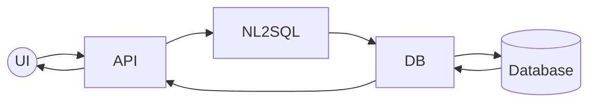

# E-commerce Application Flow

## Simple Flow Description
- User interface sends queries to API
- API processes and sends to NL2SQL converter
- Converted SQL queries go to database handler
- Database executes and returns results
- Results flow back to user through the same path
